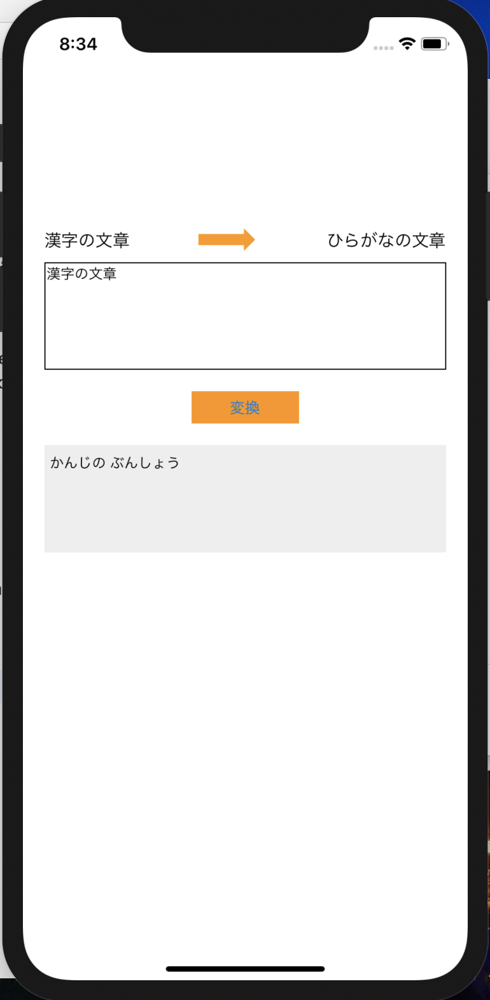

# HiraganaApp
App for change from kanji to hiragana

## Overview
漢字の文章を入力するとひらがなの文章を出力します 

## Description
gooのひらがな化APIを利用してテキストフィールドに入力された漢字の文章からひらがなの文章を出力するアプリです

## Requirement
Alamofire

## Author
iOS Developer 
Kazuma Noha
